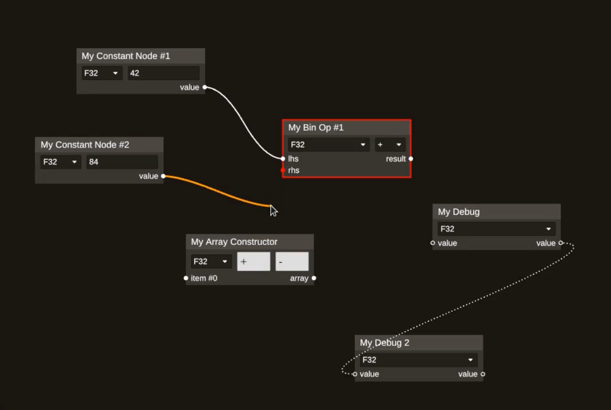

# DVSynth — Digital Video Synthesizer
DVSynth is a real-time graph-based video compositor for broadcasting and creative coding.

[](demos/demo-linting.mov?raw=true)

## Development
### Generating Documentation
To generate docs with properly rendered math expressions, use the following command. Optionally add the `--open` flag to open the generated docs in the browser.
```sh
env RUSTDOCFLAGS="--html-in-header doc/katex.html" cargo doc --no-deps
```

### Editing Dependencies Effectively
When working on the project, it helps to be able to change the source code for some of the dependencies. This can be done by cloning the source code of the dependency and then adding the path to [`~/.cargo/config.toml`](https://doc.rust-lang.org/cargo/reference/config.html):

```toml
paths = [ "workspace/rust/iced" ]
```

This way, `Cargo.toml` can be left unchanged and the local source code for those dependencies will be used.
